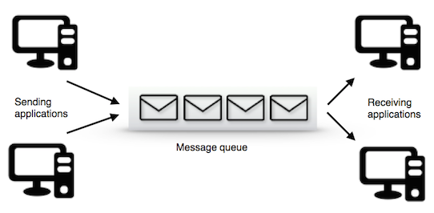
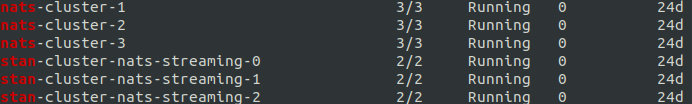

# PubSub, not Nats

## Disclaimer
>Before we go into the issues we experienced with Nats I want to point out that we are not perfect and our activities may have contributed to some of the tension.


## What is it?
Lets start at the beginning:



What we are obseriving here is a system that can receive messages from multiple clients onto a queue\
and distribute them to as many clients as you would like. This means that it is an directional n2m relationship.

[Google Pubsub](https://cloud.google.com/pubsub/) is then an implementation of this concept and it is managed!

## Prelimenary history lesson
```
In the beginning there was [Nats](https://nats.io/)
Good, but *huge* (issues)
```

### Finding a mate
When Bulderbank was founded the plan was to use Google Pubsub. \
This was the preferred choice because we already had committed to
[GCP](https://console.cloud.google.com/) and 
[Firebase](https://firebase.google.com/)

However, there were a few issues that we had to resolve before we could commit to Pubsub. 

### Early issues / Enter Chad [GDPR](https://gdpr-info.eu/) 


At the time Google PubSub could not guarantee that the message did not take a shortcut from Norway, out of the EU and back into Norway. Makes sense right?\
In addition there was some concern that during testing two developers would compete on receiving the message if both used the same subscriber. This was of course before there was such a thing as an emulator.

### So... Who is the chosen one?
There was only two real candidates when choosing an MQ, Nats and [RabbitMQ](https://www.rabbitmq.com/). 
As I have already spoiled we shot the rabbit(mq) and set up Nats to the best of our abilities.\


## Nats - Good for a forthnight 
Nats is fast, scalable and very easy to use during local development with docker-compose
However, as our architecture grew and the number of topics grew, our insight into Nats dissapeared.
We started experiencing having little controll of failed deliveries, number of redeliveries and general system status.
Our experience with introducing third parties (C#) into the releationship did not go well. 

#### Self Hosted
Since the beginning of bulder we have tried to use as many managed services as possible. The reasons for this is two-fold. Firstly we are a small team and want to spend our time on business logic, not maintaining/bughunting/setting up systems. 
The second reason is that we were tired 


### Divorce Time
In late 2020 messages from the one deploying one of our services was more often than not

>New highscore, this time it took the engine 32 restarts to get up and running 

And the error messages became more and more incomprehencible.

>panic: nats: Authorization Violation 

The message above was received in the middle of two deployments that was successful.

In spesific terms it was our combination of hosting on kubernetes and deploying Nats and Stan clusters, combined with the way Nats has file based storage that made us rethink the way we were developing our infrastructure.


## PubSub - The one that got away
We turned our eyes back in time and remembered our preferred choice PubSub. So like any normal person we started stalking PubSub and checked homepage for status updates. 
What we found was heaven. Thanks to the engineers at google they could now promise us that the pubSub message would not temporary migrate to America. This made us very happy. PubSub also exports stats to stackdriver which made it very easy to set up meaningful dashboards in [Grafana](https://grafana.com/)


